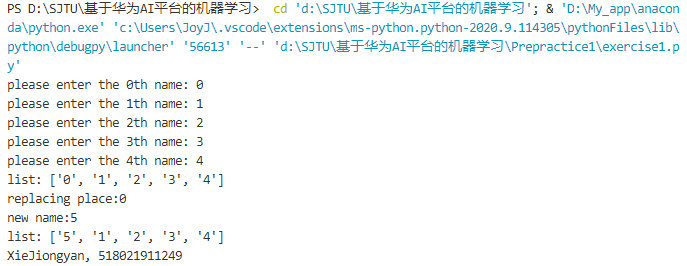
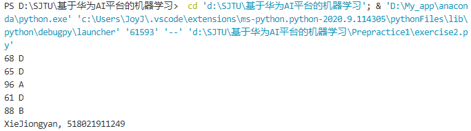

# prepractice1 课前练习：安装Anaconda学习Python基础（10.17前）

## 问题一

> 写一个程序，让用户提供5个名字。程序要把5个名字保存在一个列表中打印出来。
> 然后，让用户能替换其中一个名字（ 用户能选择要替换第几个名字，然后键入新名字），输出用户替换之后的列表。

*codes:*
```python
list = ['name'] * 5

for i in range(5):
    print("please enter the ", i, "th name: ", sep= '', end = '')
    list[i] = input()

print('list:', list)
print('replacing place:', sep= '', end = '')
i_rep = int(input())
print('new name:', sep= '', end = '')
list[i_rep] = input()
print('list:', list)
print('XieJiongyan, 518021911249')
```

*screenshot:*


## 问题2

> 建立一个函数对成绩进行评定，要求从100-60分别划分为ABCD四个等级。随机输入5次60-100范围内的数，给出相应的等级

分级：

- $[60, 70)$ 为D级
- $[70, 80)$ 为C级
- $[80, 90)$ 为B级
- $[90, 100)$ 为A级

随机输入明确为在该范围内的均匀分布

*codes:*

```python
from random import randint 

for i in range(5):
    score = randint(60, 100)
    char_add = (100 - score) // 10
    print(score, chr(ord('A') + char_add))

print('XieJiongyan, 518021911249')
```

*screenshot:*

